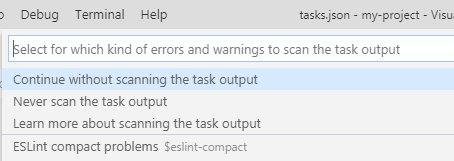

Now that we have our new project configured, we want to run it.

Open Visual Studio code in the folder of your prject (`my-project` in our case).

# The different servers
When developing an angular application in a dev environment we'll need two servers,
1. Angular dev server - used by Angular for the front end development (the ui that'll run in the browser),
2. Node JS web server - is the Actual server, where all the data access will be and all the heavy lifting will be done.

## The tasks we'll use

### 1. Run the automatic typescript build
1. press <kbd>Control</kbd> + <kbd>Shift</kbd> + <kbd>P</kbd> to open visual studio's code `command pallet`
2. Select `Tasks:Run Task`

     
3. Select `npm:server:build-watch`
 
     
4. You might see the following question:
    

    If so - please choose `Never scan the task output`
5. You'll now see at the bottom part of your screen a new terminal window running the typescript compiler in watch mode - meaning that whenever you change a file, it'll automatically rebuild your code.

     

### 2. Run the Node JS Server
Simply press <kbd>F5</kbd> and it'll run.

If you'll click on the `DEBUG CONSOLE` at the bottom of the editor, you'll see that it's running:

This server is your api server, it shows which api's are now available and it will serve as the server of our application

### 3. Run the Angular Dev Server
1. press <kbd>Control</kbd> + <kbd>Shift</kbd> + <kbd>P</kbd> to open visual studio's code `command pallet`
2. select `Tasks:Run Task`

     
3. select `npm:ng:dev`
4. You might see the following question:
    
    
    If so - please choose `Never scan the task output`
5. You'll now see at the bototm part of your screen a terminal window running the Angular web server:
6. 

## Great, now we can start
Simply open a browser with the url `http://localhost:4200` and you'll see your application running

