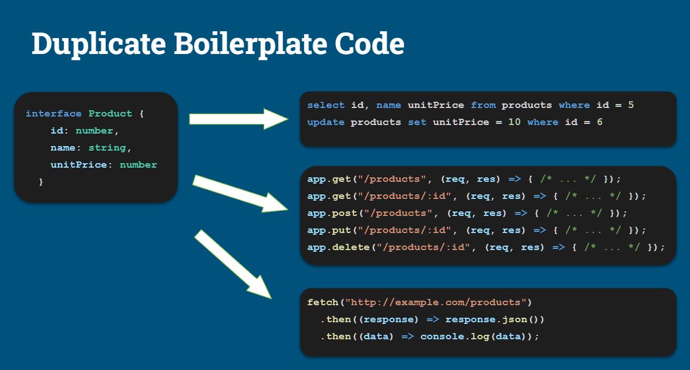
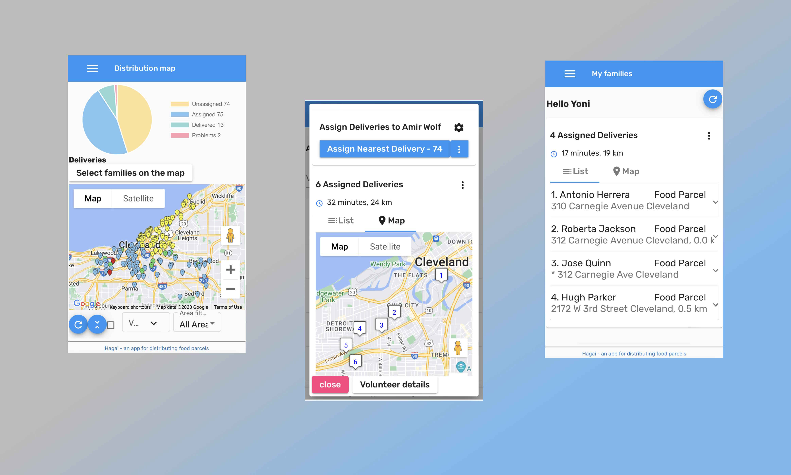

> March 14, 2023 | Noam Honig

# Introducing Remult: The Backend to Frontend Framework You Always Wanted

Application developers, as their name implies, like to develop applications––they ultimately care very little about frontend vs. backend, and really just want to deliver value to users.  Being an application developer myself, and very much like other application developers, one of the things that constantly drives my decision making when selecting tools and frameworks is the fact that I’m also quite lazy. 

My main objective is to be able to ship applications with as little effort as possible, and my pet peeve is silly repetitive, mechanical tasks that make me die a little inside every time I need to perform them. For example, I don’t like to have to remember to align things that don’t automatically align themselves, as one common example of a repetitive task that is completely superfluous.  I guess my trademark is that when I encounter challenges, I will always look for ways to automate a solution.  (Like the app I once built in the 90s to send a romantic text message to my girlfriend once a day––to overcome my own romantic shortcomings).

I've been building tools and frameworks to increase developer productivity most of my professional career.  This all started back in 2006, when I identified a need for modernizing applications created using a low-code generator, to C#.NET.  I decided to not only create a fully automated migration solution but more importantly, create a C# class library that would enable an equivalent speed of development that was previously made possible by using the low-code tool.

This was a very high bar, as developers that are used to working in low-code are also often the type that don’t really like the details or the bits and bytes of the internals.  A developer who is happy to use low-code tooling is essentially only looking to write code that gets a specific task done.  Being able to replicate this in a coding framework needed to provide as seamless and simple of an experience that they had until now––but with code.  

Hundreds of organizations have used Firefly’s migration solution, from fortune 500s and governments to small software houses. The C# library provided   is still in use today, enabling “low-code level”, highly productive application development, combined with the flexibility of code.  

The ability to efficiently ship full applications with a simple library, to me, felt like something that had to be portable and replicated to the modern web.  The wheels began to turn.

## What Brought Us Here

Like many other web developers, when Node.js came out, I was excited about the promise of backend to frontend that came with it, that finally we don’t have to learn two languages to build a full stack application.  Just the sheer mental switch between languages––for me it was C# on the backend and then Javascript on the frontend, and this always came with its toll of friction and context switch that could even be considered debilitating to my dev workflow.

Even with the possibility Node.js presented of enabling Javascript on both ends, still not many developers chose to do so. All of the best practices and learning resources continued to recommend using two separate approaches for backend and frontend, and a complete separation of tools, libraries and frameworks with very little sharing of code and patterns for frontend and backend.

This modus operandi of having two separate languages each with its own syntax and logic, creates the need for a lot of repetitive boilerplate, such as code to pull the data from the database (for every single application entity), code to expose entity CRUD operations as an API, with four, five or even six different routes per entity, methods for these routes, and these all would again get duplicated and reused hundreds of times, and each time further complicated. You get the idea.  

And this is just on the backend. 

Now on the frontend you have reverse code for this, you have code that takes these JSON responses and rebuilds objects out of these, for you to be able use them on the frontend.  Just trying to get data from the database to the users, but in the meantime, you need code to read the database, serialize the JSON, send it over a route, only to have to deserialize and query it on the frontend, just to get it in front of the user.  

This is all mechanical code that practically does nothing.  Where, eventually, all of this is repeatable.  

Wait, there’s more. Every API route needs to be able to fetch data, provide some sort of server-side paging, sorting and filtering, delete, insert, and update, all of these very generic actions are repeated over and over by all developers building full stack applications all the time in millions of lines of code.  

Now let’s talk about concerns that cross over from the frontend to the backend that get duplicated. Up until a couple of years ago the frontend and backend were at best sharing types, but there’s so much more to types than just strings or integers.  

Commons questions like: how do you serialize these from JSON and then to JSON? How do you validate them? Today, validations on the frontend and backend are operations that are completely separate.  Which begs the questions WHY?  Why should I have to remember (as a lazy developer mind you) to have to perform two separate validations on the frontend and the backend?

There’s also a cultural aspect with this dichotomy between frontend and backend code, where there needs to be such impeccable communication and alignment between the developers, that is almost an impossible feat.  At the end of the day,  all of those places are places of friction where things can go wrong, with two completely different developers maintaining the code.

## Enter Remult

Remember when I said that when I encounter a challenge, my first course of action is to try and automate it away?  I couldn’t fathom how in 2018 it still is not viable to be able to get the same code to run on the frontend and the backend.  I started toying with this idea to see if I could truly make this possible, improve my own productivity (and hopefully for other developers too)––from validations, to typing, through authentication and authorization, all of the typical code that’s constantly being duplicated.

### The Remult Backstory 

Remult started as a side project, without a name, and with a completely different (albeit noble) purpose.  My wife volunteered at a food bank, and as a result, I too was volunteered to participate in distributing food parcels to the needy.  One day, as I was driving to distribute the parcels, holding a paper with a list of addresses I found myself getting lost in places you don’t want to get lost, and I knew I had to build them an app to help volunteers navigate efficiently.  I knew I could solve a lot of friction in the process of delivering food parcels to the needy through code––which is what I do best, and I wanted to focus on building the actual application and its capabilities, and not the pieces that hold it together.

So I built an application for inventory and distribution of our local food bank in Even Yehuda, an application they could use to generate distribution lists for volunteer couriers, and for the couriers to be able to navigate to and report back on delivery. I wrote the app, and at the same time the framework as well, the very framework I wanted to have when building web applications.  One that would focus on the data flow from the backend database all the way through to the frontend framework (the framework of your choice––whether Angular, React, or Vue––it shouldn’t matter). 

Instead of having to go through the entire process described above of serializing objects for every HTTP call on the frontend, and then reversing the entire process back into JSON from the backend to the frontend––this framework now made it possible to query on the frontend, using objects, and then automated the entire process from the frontend to the backend and back again.  I finally had the framework I dreamed of that eliminates the need to write all of this boilerplate, repetitive, duct tape code over and over again.

With its growth and use, a colleague and I worked on the framework, invested in its ability to scale and its stability, improved its API that underwent several iterations, and added many features.  The application built upon this frameworkIt was quickly adopted by other food banks around Israel who often encountered similar challenges with parcel delivery.  Our application after its first year managed to help distribute 17,000 parcels from food banks around Israel.  We were quite proud of this achievement––we started feeling like our framework could possibly withstand the test of scale, but we had no idea what was to come next..  

## What COVID Taught us About Scale and Security

Then COVID hit––and lock downs cut people in need off from the entire world.  Suddenly, the need to distribute food to the elderly and disabled skyrocketed.  The demand grew from 17,000 parcels annually to 17,000 parcels a day.  The app was then contributed for free to municipalities, NGOs and even the IDF’s Home Front to enable better inventory, allocation and distribution of parcels around Israel.

Once the application was adopted by the IDF, it also underwent a battery of security testing––cyber and penetration testing, which leveled up its security significantly.  The backend to frontend framework, and the application built upon it that was supposed to be just an experiment, withstood the scale of half a million parcel distributions in 2020 alone, and since then has maintained a similar number and is only growing.  During COVID it was adopted by  multiple countries around the globe––from Australia, to the EU, USA, and South Africa––to respond to similar needs during the pandemic.  

This is the backbone upon which Remult was built and battle tested, with all of this running on a $16-a-month Heroku server.  

Once the pandemic was behind us, my co-creator and I realized we had learned a lot.  We understood the framework was robust and could scale, was aligned with security best practices, and delivered the promise of democratizing the ability to build full stack applications without all of the known friction.

We wanted to share this with the world. 

So we open sourced the framework, to enable other lazy developers like us to be able to invest their energy in writing excellent applications that deliver value to users, and not on repeatable, mechanical code that apparently actually **can be automated** and shared by the backend and frontend.

Check out [Remult](https://remult.dev), and if you like it, give it a star.  Let us know what you’d like to see next, and also feel free to contribute to the project.

In our next post, we’ll do a roundup of tools in the ecosystem looking to solve similar challenges though different approaches, and unpack where Remult fits in, and what it’s optimized for.
