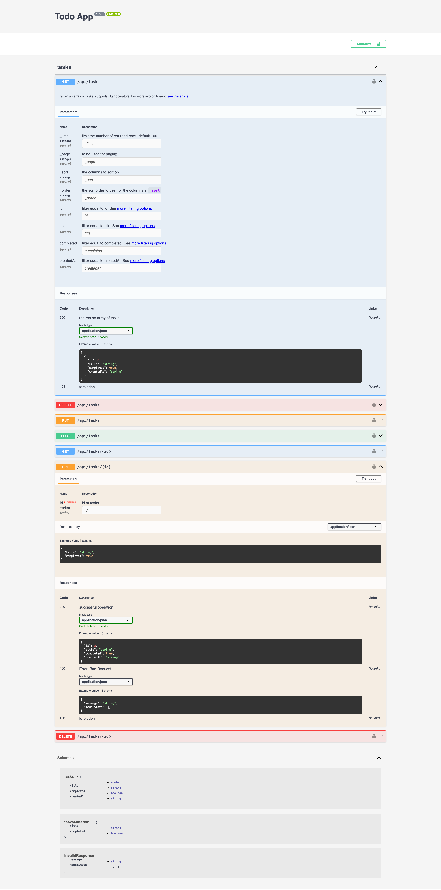

# Adding Swagger and openApi

In short, swagger provides a quick UI that describes the api which is exposed by the application.

To add swagger to a `remult` application follow these steps:

1. Install the `swagger-ui-express` package:

   ```sh
   npm i swagger-ui-express
   npm i --save-dev @types/swagger-ui-express
   ```

2. In the `/src/server/index.ts` file add the following code:

   ```ts{2,6-9}
   import express from 'express';
   import swaggerUi from 'swagger-ui-express';
   import { remultApi } from 'remult/remult-express';

   const app = express();
   let api = remultApi({});

   app.use(api);
   const openApiDocument = api.openApiDoc({ title: "remult-react-todo" });
   app.get("/api/openApi.json", (req, res) => {res.json(openApiDocument)});
   app.use('/api/docs', swaggerUi.serve, swaggerUi.setup(openApiDocument));

   app.listen(3002, () => console.log("Server started"));
   ```

## Adding Swagger UI to a NextJs App

To add swagger UI to a `NextJs` application follow these steps:

1. Install the following packages:

   ```sh
   # With npm
   npm i swagger-ui-react
   npm i -D @types/swagger-ui-react

   # With yarn
   yarn add swagger-ui-react
   yarn add -D @types/swagger-ui-react
   ```

2. Get the openApi document from remultApiServer:

   ```ts
   // src/api.ts
   import { Task } from '@/shared/Task'
   import { TasksController } from '@/shared/TasksController'
   import { remultApi } from 'remult/remult-next'

   export const api = remultApi({
     admin: true,
     entities: [Task],
     controllers: [TasksController],
   })

   // Export this here 👇
   export const openApiDoc = api.openApiDoc({
     title: 'Todo App',
   })

   export const { POST, PUT, DELETE, GET } = api
   ```

3. Create a new page to render Swagger UI:

   ```tsx
   // src/app/api-doc/page.tsx
   import { openApiDoc } from '@/api' // 👈 Import the openApiDoc you exported earlier
   import ReactSwagger from './react-swagger'

   export default async function IndexPage() {
     return (
       <section className="container">
         <ReactSwagger spec={openApiDoc} />
       </section>
     )
   }
   ```

   ```tsx
   // src/app/api-doc/react-swagger.tsx
   'use client'

   import SwaggerUI from 'swagger-ui-react'
   import 'swagger-ui-react/swagger-ui.css'

   type Props = {
     spec: Record<string, any>
   }

   function ReactSwagger({ spec }: Props) {
     return <SwaggerUI spec={spec} />
   }

   export default ReactSwagger
   ```

4. Navigate to `http://localhost:3000/api-doc` to see the Swagger UI.

   

## Adding Scalar UI to a SvelteKit

1. Install [Scalar](https://scalar.com) to get a modern OpenAPI UI with a built-in interactive playground:

   ```sh
   npm i @scalar/sveltekit
   ```

2. Export OpenAPI document schema from your Remult API in `src/server/api.ts` file:

    ```ts{8-11}
    import { Planet } from '$lib/entities';
    import { remultApi } from 'remult/remult-sveltekit';

    export const api = remultApi({
      entities: [Planet]
    });

    export const openApiDocument = api.openApiDoc({
      title: 'remult-planets',
      version: '1.0.0'
    });
    ```

3. Add a SvelteKit server route in `src/routes/api/[...remult]/openapi.json/+server.ts` that will handle OpenAPI json file:

    ```ts
    import { json } from '@sveltejs/kit';
    import { openApiDocument } from '../../../../server/api';

    export const GET = () => {
      return json(openApiDocument);
    };
    ```
  
4. And finally create an endpoint for Scalar OpenAPI at `src/routes/api/[...remult]/docs/+server.ts`

    ```ts
    import { ScalarApiReference } from '@scalar/sveltekit';
    import type { RequestHandler } from './$types';

    const render = ScalarApiReference({
      url: '/api/openapi.json' // the above endpoint where the openapi spec is located
    });
    
    export const GET: RequestHandler = () => {
      return render();
    };
    ```

In this case the UI will be available at [http://localhost:5173/api/docs](http://localhost:5173/api/docs) 

# Adding open api specific field options

Checkout the following example project that demos how to add `openApi` specific options to field options
[stackblitz](https://stackblitz.com/github/noam-honig/adding-open-api-options?file=server/build-open-api.ts,shared/task.ts)
[github](https://www.github.com/noam-honig/adding-open-api-options)
