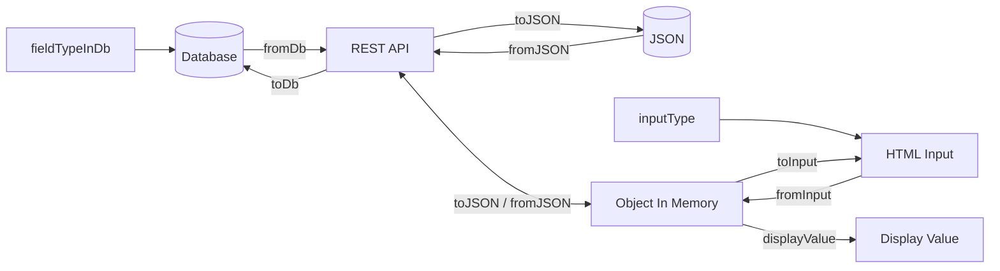

# ValueConverter

Interface for converting values between different formats, such as in-memory objects, database storage,
JSON data transfer objects (DTOs), and HTML input elements.

Converters could be visually represented like this:



## fromJson

Converts a value from a JSON DTO to the valueType. This method is typically used when receiving data
from a REST API call or deserializing a JSON payload.

_returns_
The converted value.

_example_

```ts
fromJson: (val) => new Date(val)
```

Arguments:

- **val** - The value to convert.

## toJson

Converts a value of valueType to a JSON DTO. This method is typically used when sending data
to a REST API or serializing an object to a JSON payload.

_returns_
The converted value.

_example_

```ts
toJson: (val) => val?.toISOString()
```

Arguments:

- **val** - The value to convert.

## fromDb

Converts a value from the database format to the valueType.

_returns_
The converted value.

_example_

```ts
fromDb: (val) => new Date(val)
```

Arguments:

- **val** - The value to convert.

## toDb

Converts a value of valueType to the database format.

_returns_
The converted value.

_example_

```ts
toDb: (val) => val?.toISOString()
```

Arguments:

- **val** - The value to convert.

## toInput

Converts a value of valueType to a string suitable for an HTML input element.

_returns_
The converted value as a string.

_example_

```ts
toInput: (val, inputType) => val?.toISOString().substring(0, 10)
```

Arguments:

- **val** - The value to convert.
- **inputType** - The type of the input element (optional).

## fromInput

Converts a string from an HTML input element to the valueType.

_returns_
The converted value.

_example_

```ts
fromInput: (val, inputType) => new Date(val)
```

Arguments:

- **val** - The value to convert.
- **inputType** - The type of the input element (optional).

## displayValue

Returns a displayable string representation of a value of valueType.

_returns_
The displayable string.

_example_

```ts
displayValue: (val) => val?.toLocaleDateString()
```

Arguments:

- **val** - The value to convert.

## fieldTypeInDb

Specifies the storage type used in the database for this field.

_example_

```ts
readonly fieldTypeInDb = 'decimal(18,2)';
```

## inputType

Specifies the type of HTML input element suitable for values of valueType.

_example_

```ts
readonly inputType = 'date';
```
