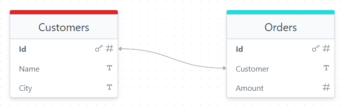

# Relations

In this chapter, we’ll explore how to work with entity relations in Remult using customers and orders as our example.



## Many-to-One Relation

To create a many-to-one relation in Remult, we use the `@Relations.toOne` decorator. This decorator establishes a connection between the `Order` entity and the `Customer` entity, where multiple orders can be associated with a single customer.

For instance, in our project, the `Order` entity includes a reference to the `Customer` entity. The highlighted lines below in `Order.ts` show how this relation is defined:

```file:/shared/Order.ts ins={8-9} collapse={1-3} title="shared/Order.ts"


```

This setup creates a many-to-one relationship where each `Order` is connected to a `Customer`.

### Seed Data

In the `SeedData` file, you can see how this relationship is leveraged. While inserting data into the `Order` table, the `customer` field is populated with a customer object that was previously inserted:

```file:/shared/SeedData.ts title="shared/SeedData.ts" collapse={1-4} add=/customer:\s*\w+/

```

This snippet shows how orders reference existing customer objects, creating a meaningful connection between the two entities.

### Fetching Relational Data

When querying `Order` data, we can use the `include` option to retrieve the associated customer data. By default, relations are not automatically included in queries unless explicitly requested.

Here’s how to include the `Customer` info when fetching orders:

```ts title="frontend/Page.tsx" add={2-4}
const orders = await repo(Order).find({
  include: {
    customer: true,
  },
})
```

This will return the `Order` data along with the related `Customer` data. If you set the `include` value to `false`, the `customer` field will be `undefined` in the result.

You can experiment by toggling the `include` value between `true` and `false` to observe how the results change.

### Always Including a Relation

If you want the related `Customer` data to be automatically included in every query, you can set the `defaultIncluded` option when defining the relation. This ensures the relation is always loaded unless explicitly excluded:

```ts add=/defaultIncluded: true,/
@Relations.toOne(() => Customer, {
  defaultIncluded: true,
})
customer?: Customer
```

This setting saves you from having to manually include the relation in each query, ensuring the related data is always available when you need it.

By using relations effectively, you can create more sophisticated and connected data models, enhancing the power and flexibility of your applications built with Remult.

Here’s a polished version of the paragraph:

### Relations in Remult Admin

Relations are seamlessly integrated into the [Remult Admin UI](https://remult.dev/docs/admin-ui). To explore how relations are displayed, simply click the "Remult Admin UI" link at the bottom.
