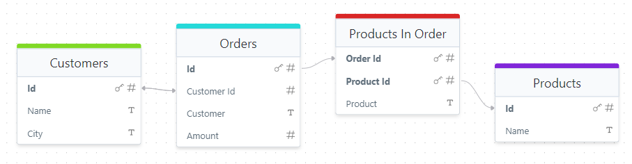

# Many-to-Many Relations

In some applications, an entity might need to have a relationship with multiple entities from another table, and vice versa. In our case, an `Order` can contain many `Products`, and the same `Product` can appear in many `Orders`. This is a classic **many-to-many** relationship.

To implement this relationship, we use an intermediate entity called `ProductInOrder`, which serves as a bridge between `Order` and `Product`. This intermediate entity stores the association between an order and a product, along with additional details that pertain to the relationship, such as quantity or price, if needed.



### Defining the Many-to-Many Relation

Let's define the `ProductInOrder` entity, which establishes the many-to-many relation between `Order` and `Product`.

```file:/shared/ProductInOrder.ts title="shared/ProductInOrder.ts"

```

### Key Points

1. **Composite Primary Key**:  
   We define the composite primary key using both `orderId` and `productId` (`id: ['orderId', 'productId']`). This ensures that the combination of these two fields uniquely identifies each record in `ProductInOrder`. Using a composite key improves performance when querying or joining tables because it provides a direct and efficient way to locate specific rows.

2. **Relation to `Product`**:  
   The `@Relations.toOne()` decorator establishes a relationship between `ProductInOrder` and the `Product` entity. This allows us to easily fetch the related `Product` information (such as the name or price) when querying `ProductInOrder`.

### Defining the `Order` Entity

In the `Order` entity, we use a `toMany` relation to link each order to its products through the `ProductInOrder` entity. This allows us to keep track of all the products in a particular order.

```file:/shared/Order.ts title="shared/Order.ts" collapse={1-4,8-13} add={15-16}

```

### Querying the Data

When you want to fetch the data, including the related products, you can use the `include` option to fetch not only the `ProductInOrder` records but also the corresponding `Product` details.

```ts title="frontend/Page.tsx"
repo(Customer).find({
  include: {
    orders: {
      include: {
        products: {
          include: {
            product: true, // Fetch product details such as name, price, etc.
          },
        },
      },
    },
  },
})
```

### Why Not Use a Built-in Many-to-Many Feature?

A natural question arises: why not create a built-in many-to-many relation directly between `Order` and `Product` without an intermediate table?

The reason is that most **many-to-many relationships** in real-world applications are not that simple. Typically, you will need to store additional information about the relationship itself, such as **quantity**, **pricing**, **discounts**, or **status**. By using an intermediate entity like `ProductInOrder`, you have the flexibility to store these additional attributes alongside the relationship. This approach is much more versatile and better suited to real-world use cases than a basic many-to-many relation, which can be too limited for most scenarios.

### Summary

In this lesson, we've learned how to model many-to-many relationships using an intermediate table. By creating the `ProductInOrder` entity, we've enabled a flexible many-to-many relationship between `Order` and `Product`. This approach allows us to include additional fields, such as quantity, in the relationship while maintaining optimal performance through the use of composite keys.
